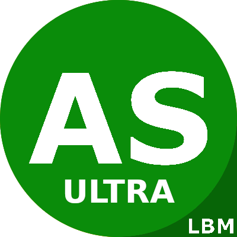
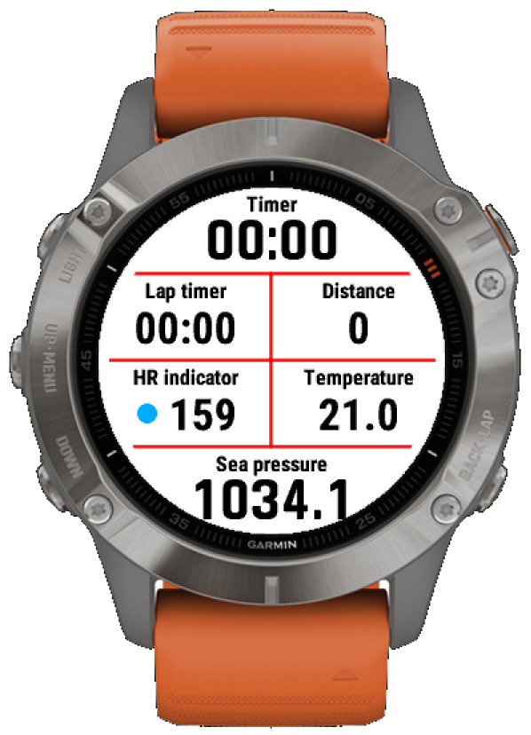
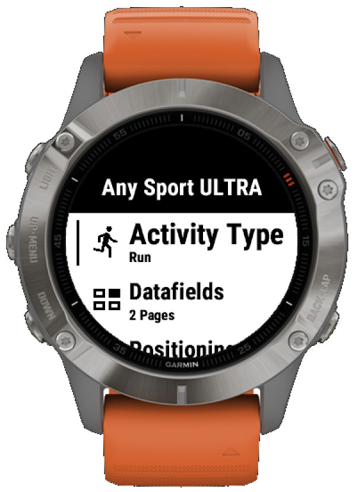
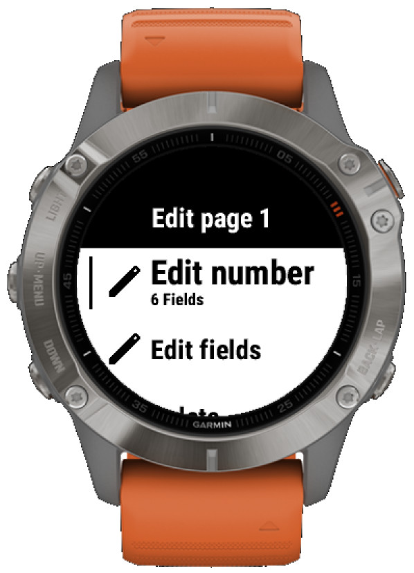
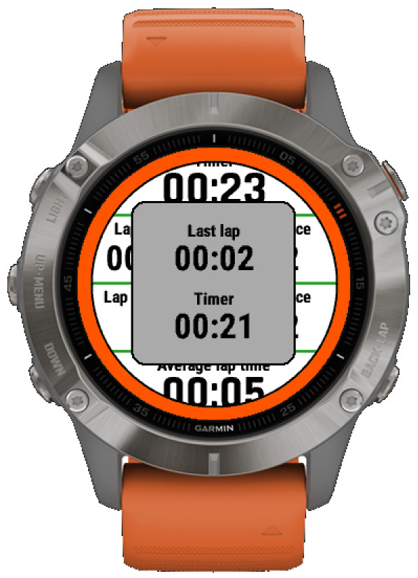
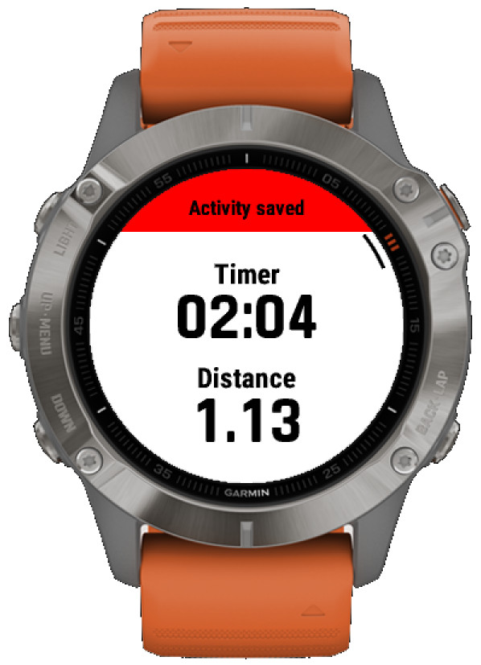
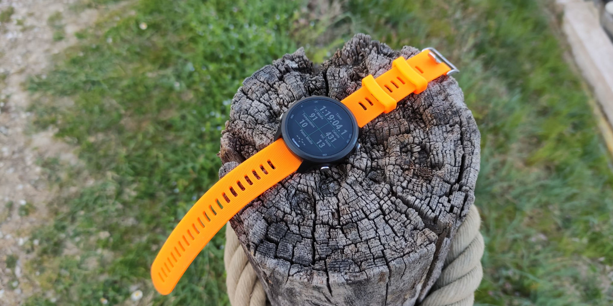

  

# Any Sport ULTRA

**Any Sport ULTRA** allows for recording activities using all the native sport profiles that are 
supported by Garmin, even if not natively supported by your device.

With this app, you'll unleash the true potential of your Garmin watch.

For more info, visit the [manual](https://github.com/calugj/anysport/blob/main/doc/manual.md).

# Screenshots

  
  
  
  
  

# Open Source Licenses
This product is licensed under the [GNU GPL Version 3.0](https://www.gnu.org/licenses/gpl-3.0.txt).

This product includes resources and assets that are licensed under the
[Apache License Version 2.0](https://www.apache.org/licenses/LICENSE-2.0.txt):
- [Material Design Icons](https://github.com/google/material-design-icons?tab=readme-ov-file), by Google.

# 

  

